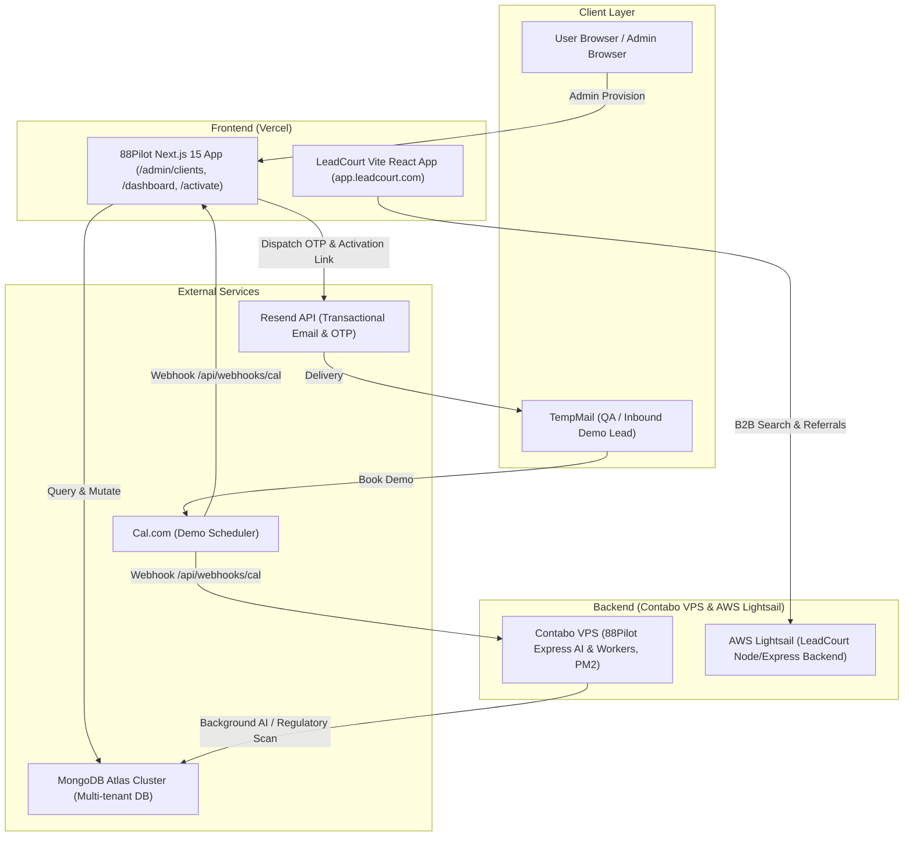

# 88Pilot & LeadCourt: Complete Technical Documentation & End-to-End Operational Manual

---

## 1. System Architecture Overview



---

## 2. Complete End-to-End Walkthrough: Demo Booking to Active Organization

This operational lifecycle explains step-by-step how an inbound prospect goes from a temporary email to an active company workspace, covering every API call, token generation, and edge case.

### Step 1: Inbound Lead Creation (Temp-Mail)
1. Navigate to a temporary email provider (e.g. `temp-mail.org`, `1secmail`, or `mohmal`) and copy an email address (e.g., `lead.tester@tempmail.com`).
2. Go to the **88Pilot** landing page (`88pilot.com`) and click **"Book a Demo"**.
3. **Internal Path A (Internal Modal):**
   - The user inputs their Name, Company, and Email.
   - The form sends `POST /api/admin/clients`:
     ```json
     {
       "name": "Jane Doe",
       "email": "lead.tester@tempmail.com",
       "organizationName": "Acme Corp",
       "role": "HR Director"
     }
     ```
   - Saved into `PendingLeadModel` with `status: "demo_scheduled"`, `source: "admin_manual"`.
4. **Internal Path B (Direct Cal.com Scheduler):**
   - User picks a calendar slot on `cal.com/88pilot/30min`.
   - Cal.com emits a `BOOKING_CREATED` webhook to `https://88pilot.com/api/webhooks/cal`.
   - The webhook parses `payload.attendees[0].email`, `payload.name`, and company form responses, saving the document into `PendingLeadModel` with `source: "cal.com"` and `status: "demo_scheduled"`.

---

### Step 2: Admin Dashboard Lead Management
1. Log into the 88Pilot Admin Console at `/admin/clients` using your Admin credentials.
2. Under the **"Standard Demo Leads Pipeline"** tab:
   - The lead appears showing Name, Email, Organization, and Status (`demo_scheduled`).
3. Click the blue **"Provision"** button next to the lead (or click **"+ Send Activation Link"** at the top right).
4. The **Provision Client Workspace Dialog** opens with:
   - **Client Lead Email:** Pre-filled with `lead.tester@tempmail.com`.
   - **Plan Allocation:** `PENDING_SELECTION` (Standard - client chooses plan upon login), `STARTER`, `PRO`, or `BUSINESS`.
   - **Max Seat Quota:** Defaults to `5` (controls team invitations).
   - **Operating Jurisdictions:** Multiselect for federal and state labor laws (e.g., California, New York, Texas).
5. Click **"Provision Workspace & Send Activation Link"**.

---

### Step 3: Token Generation & Email Dispatch (`/api/admin/provision`)
When the admin submits the modal, `POST /api/admin/provision` runs:
1. **Invalidates Older Tokens:** Marks any previous unused tokens for this email as `used: true`.
2. **Generates Cryptographic Credentials:**
   - 256-bit secure URL token: `crypto.randomBytes(32).toString("hex")`.
   - 6-digit numeric OTP: `Math.floor(100000 + Math.random() * 900000)`.
   - Expiration timestamp: 48 hours from generation.
3. **Upserts Organization Document:**
   - Creates an entry in `organizations` with:
     ```json
     {
       "name": "Acme Corp",
       "ownerId": "lead.tester@tempmail.com",
       "plan": "PENDING_SELECTION",
       "maxSeats": 5,
       "usedSeats": 1,
       "status": "PENDING_SELECTION"
     }
     ```
4. **Updates Lead Status:** Updates `PendingLeadModel` to `status: "activated"`. *(This automatically transitions the lead from the "Standard Demo Leads" pipeline to "Active Organizations".)*
5. **Dispatches Email via Resend:**
   - Sends from `88Pilot Setup <verification@88pilot.com>`.
   - Email includes the 6-Digit OTP and an activation button:
     `https://88pilot.com/activate?token=<HEX_TOKEN>`

---

### Step 4: Client Activation & Onboarding (`/activate`)
1. In TempMail, the client receives the **"Activate your 88Pilot Account"** email.
2. Clicking the link takes the client to `88pilot.com/activate?token=<TOKEN>`.
3. The page loads the token parameters and requests:
   - **Full Name**
   - **Password** (minimum 8 characters)
   - **6-Digit OTP Code**
4. Submitting calls `POST /api/auth/activate`:
   - Validates that the token and OTP match and are not expired.
   - Hashes the password using high-entropy bcrypt.
   - Upserts the User in Better-Auth (`user` and `account` collections).
   - Upgrades `Organization` owner to the new user ID.
   - Creates an authenticated session cookie (`session_token`) so the client is logged in without re-entering credentials.
   - Redirects the user directly to `/onboarding` or `/dashboard`.

---

## 3. Frontend & Backend API Reference

### A. 88Pilot Frontend Routes (Next.js 15)

| Endpoint | Method | Description | Request Payload / Params |
|---|---|---|---|
| `/api/admin/clients` | `GET` | Fetches organizations, enterprise leads, standard demo leads, and tickets | None |
| `/api/admin/clients` | `POST` | Manually inserts an inbound lead into the demo pipeline | `{ name, email, organizationName, role }` |
| `/api/admin/clients` | `DELETE` | Deletes an organization, lead, ticket, or assessment | `?orgId=...` or `?leadId=...` |
| `/api/admin/provision` | `POST` | Provisions workspace, generates OTP/token, sends email | `{ email, organizationName, maxSeats, plan, allowedStates, leadId }` |
| `/api/auth/activate` | `POST` | Verifies token & OTP, sets password, creates auth session | `{ token, otp, password, name }` |
| `/api/auth/activate/resend` | `POST` | Resends OTP email if code expired | `{ email }` |
| `/api/webhooks/cal` | `POST` | Receives Cal.com booking webhooks | Cal.com standard webhook payload |
| `/api/dashboard/stats` | `GET` | Returns real-time health score, quotas, and state coverage | None |
| `/api/copilot` | `POST` | Proxies user queries to Contabo AI engine, tracks monthly quota | `{ messages, sessionId }` |
| `/api/policies/generate-scoped`| `POST` | Generates attorney-grade policy documents with multi-state logic | `{ topic, state, industry, headcount }` |

### B. 88Pilot Backend Routes (Contabo Express)

| Endpoint | Method | Description |
|---|---|---|
| `GET /api/webhooks/cal` | `GET` | Health ping for Cal.com webhook verification |
| `POST /api/webhooks/cal` | `POST` | Backup webhook receiver for demo bookings |
| `POST /api/ai/copilot/chat` | `POST` | Full AI Copilot pipeline: Memory -> Key Rotation -> Tavily Search -> Gemini Draft -> Groq Verification |
| `POST /api/risk-scanner/scan` | `POST` | Scans workforce data and policies for multi-state regulatory violations |
| `POST /api/certificate/generate` | `POST` | Generates cryptographic verification PDF certificates for compliance training |

---

## 4. Edge Cases & Troubleshooting Matrix

| Edge Case / Scenario | Root Cause | Handling & Resolution |
|---|---|---|
| **Booked demo on Cal.com does not appear in Demo Leads** | Webhook URL in Cal.com points to dead URL or expired ngrok tunnel | Update Cal.com Webhooks settings to `https://88pilot.com/api/webhooks/cal` with event `BOOKING_CREATED`. |
| **Demo Lead vanished from "Standard Demo Leads"** | Lead was provisioned | In 88Pilot architecture, provisioning transitions a record to **"Active Organizations"** with status `PENDING_SELECTION`. Check the first tab. |
| **OTP expired in TempMail (15 min limit)** | TempMail delay or user was away | Click **"Resend OTP"** on the `/activate` screen or re-provision from Admin Console. |
| **Hover quota showed double count (2/100 for 1 query)** | Double-counting bug in stats route | Resolved. Calculation now uses `Math.max(orgCounter, sessionUserMsgsCount)`. |
| **Sidebar quota widget required page refresh to update** | Long polling interval (60s) | Resolved. Copilot now emits a `quota-updated` DOM event that triggers instant refresh. |
| **Client exceeds Seat Quota** | `usedSeats >= maxSeats` | Admin goes to `/admin/clients`, clicks **"Manage"** on the organization, and increases Max Seat Quota. |

---

## 5. Deployment Procedures

### 88Pilot Deployment
1. **Frontend (Vercel):**
   ```bash
   cd d:\Kyoto\88Pilot\frontend
   git add .
   git commit -m "Deployment update"
   git push origin main
   ```
   *Vercel automatically detects the push, builds Next.js, and deploys to production.*

2. **Backend (Contabo VPS):**
   ```bash
   cd d:\Kyoto\88Pilot\backend
   npm run build
   python deploy_to_contabo.py
   ```
   *Transfers compiled `dist/` files via SFTP to `/var/www/88pilot-backend` and restarts PM2 (`pm2 restart 88pilot-backend`).*

### LeadCourt Deployment
1. **Frontend (Vercel):**
   ```bash
   cd d:\Kyoto\LeadCourt\leadcourt-frontend-git
   git add .
   git commit -m "Deployment update"
   git push origin main
   ```
2. **Backend (AWS Lightsail):**
   - Follow `d:\Kyoto\LeadCourt\DEPLOYMENT_GUIDE.md`:
   - Package changed files into `update.zip`.
   - Transfer to Lightsail instance and reload PM2 via the Lightsail browser terminal.
