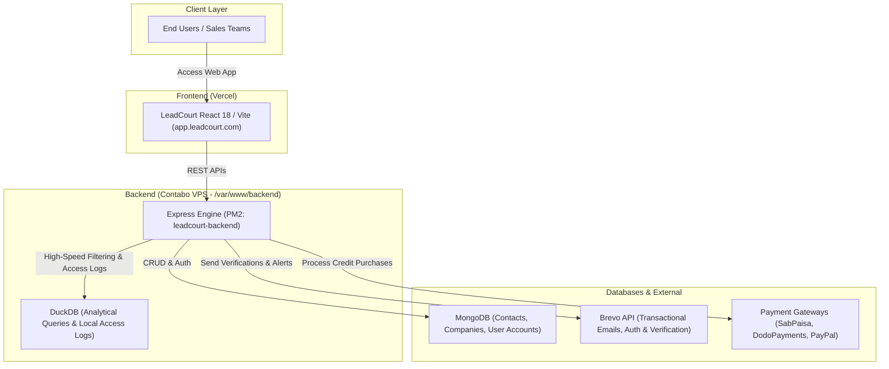

# LeadCourt: Complete Technical Documentation & Operational Manual

---

## 1. System Architecture



---

## 2. End-to-End User Operational Flow

### Step 1: User Registration & Verification
1. Access the LeadCourt app at `https://app.leadcourt.com` (or local `/register`).
2. Enter Name, Corporate Email, and Password.
3. The backend (`/routes/extAuthRoute.js`) creates an unverified account record and dispatches an activation token via **Brevo** email.
4. User clicks the verification link (`/verify-email?token=...`). Once verified, the account receives default starting credits.

### Step 2: B2B Search, Filtering & List Building
1. User logs in and visits the main Dashboard (`/pages/main/Dashboard.tsx`).
2. Current available credits are fetched via `/api/credits/balance`.
3. Users apply multi-dimensional filters (Industry, Geography, Headcount, Seniority Level, Tech Stack) via `/api/filter/query`.
4. Results are rendered with contact details masked until unlocked.

### Step 3: Unlocking Leads & Data Export
1. Clicking **"Reveal Contact"** or **"Export List"** consumes user credits according to configured rate cards.
2. DuckDB processes large data exports in background worker streams, and the output is saved to `/export_jobs`.
3. Users can download the clean CSV or sync directly via third-party integrations (HubSpot, Zoho).

### Step 4: Credit Purchases & Payment Webhooks
1. When credits are depleted, users visit `/buy-credit`.
2. Selecting a credit tier initiates a checkout session with SabPaisa, DodoPayments, or PayPal.
3. Webhook listener (`/routes/dodoRoutes.js`, `/routes/sabpaisaRoutes.js`) verifies transaction signatures and increments the user's credit balance.

---

## 3. LeadCourt Backend API Matrix (Contabo VPS - Port 5000)

| Endpoint | Method | Route File | Purpose |
|---|---|---|---|
| `/api/auth/register` | `POST` | `extAuthRoute.js` | User account registration |
| `/api/auth/login` | `POST` | `extAuthRoute.js` | User authentication & JWT generation |
| `/api/auth/verify-email` | `POST` | `extAuthRoute.js` | Token verification |
| `/api/credits/balance` | `GET` | `credits.js` | Real-time user credit check |
| `/api/filter/query` | `POST` | `filterRoute.js` | High-speed multi-filter search |
| `/api/list/export` | `POST` | `listRoute.js` | Triggers background CSV export |
| `/api/webhooks/dodo` | `POST` | `dodoRoutes.js` | Payment confirmation webhook |
| `/api/webhooks/sabpaisa` | `POST` | `sabpaisaRoutes.js` | Alternate payment gateway webhook |
| `/api/collaborators` | `GET`/`POST` | `collaboratorRoute.js` | Team member workspace management |

---

## 4. Deployment Procedures

### Frontend (Vercel)
```bash
cd d:\Kyoto\LeadCourt\leadcourt-frontend-git
git add .
git commit -m "Deployment update"
git push origin main
```
*Vercel automatically detects the push and deploys the updated build.*

### Backend (Contabo VPS)
- SSH into the Contabo server:
  ```bash
  ssh root@169.58.89.59
  # Password: OpJv9BuA010JgMZ
  ```
- Backend files are located in `/var/www/backend`.
- Manage and monitor via PM2:
  ```bash
  pm2 logs leadcourt-backend
  pm2 restart leadcourt-backend
  ```
